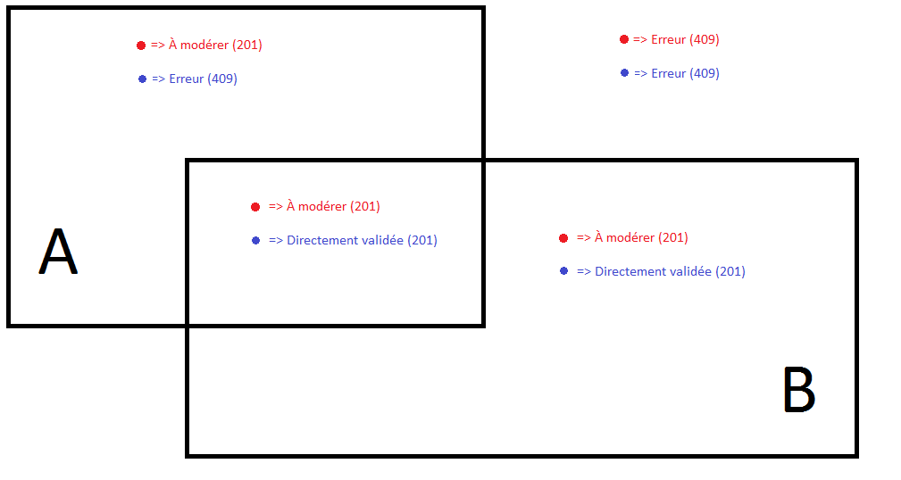
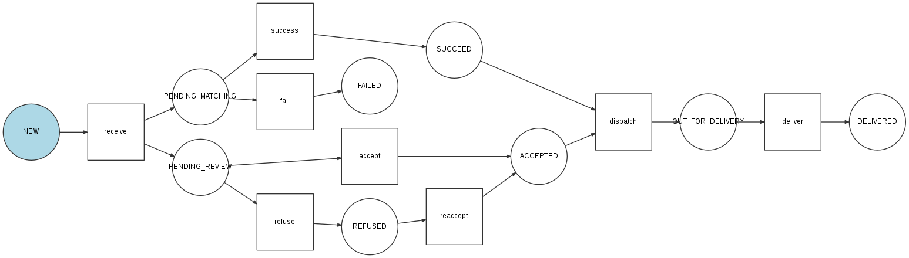

.. _feedbacks:

Feedbacks
=========

A feedback is always made in a given geographic point. This point is the most important and only mandatory component of a feedback. Optional parameters are the description, category, visibility and picture(s).

All users can make feedbacks.

.. _feedbacks-creation:

Creation
--------

.. code-block:: bash

    POST /feedbacks/issues

Minimal example of a feedback :

.. code-block:: json

    {
        "businessActivity": "4bff7cb9-0fd2-4b44-9b0e-f6d17bb4ef36",
        "geo": {
            "elevation": 1,
            "point": {
                "latitude": 44.851343,
                "longitude": -0.576326
            }
        }
    }

Complete example :

.. code-block:: json

    {
        "businessActivity": "4bff7cb9-0fd2-4b44-9b0e-f6d17bb4ef36",
        "category": "b0d007d5-e6ad-4113-b2b5-d8a1858a2fb1",
        "description": "Mon feedback 5",
        "geo": {
            "elevation":1,
            "point": {
                "latitude":44.851343,
                "longitude":-0.576326
            }
        },
        "visibility": "VISIBILITY_PUBLIC"
    }

Then the user can add one or more pictures to his feedback :

.. code-block:: bash

    POST /feedbacks/{feedback}/images

.. code-block:: json

    {
        "image":"data:image/png;base64,iVBORw0KGgoAAAANSUhEUgAAAAUAAAAFCAIAAAACDbGyAAAACXBIWXMAAAsTAAALEwEAmpwYAAAAB3RJTUUH4QIVDRUfvq7u+AAAABl0RVh0Q29tbWVudABDcmVhdGVkIHdpdGggR0lNUFeBDhcAAAAUSURBVAjXY3wrIcGABJgYUAGpfABZiwEnbOeFrwAAAABJRU5ErkJggg=="
    }

For more informations on adding images, see :ref:`technical-files`.

Match with an organization
--------------------------

The Keyclic service doesn't just collect feedbacks, it sends them if possible, as :ref:`reports`, to organizations capable of treating the feedback. Three cases are possible when transmitting a feedback :

- If the feedback's coordinates aren't in a place, then no organization will receive a report on this feedback.

- If the feedback's coordinates are in a place, then the report is sent the the organization in charge of the place.

- If the feedback's coordinates are in a place where two or more organizations can take action, and the user didn't specify a category, then several reports are generated and sent to all organizations in the place. The first one to accept will treat the problem.

For more informations about places, see :ref:`organizations-places`.

.. _feedbacks-lifecycle:

Moderation and life cycle
-------------------------

When a user creates a feedback, its state is PENDING_REVIEW : waiting moderation. A *moderator* will have to validate it (except special case : :ref:`feedbacks-agent`).

See : :ref:`technical-states`

A *moderator* validates a feedback with the endpoint :

.. code-block:: bash

    PATCH /feedbacks/{feedback}/state

.. code-block:: json

    {
        "transition": "accept"
    }

The feedback's state is now DELIVERED and a report is created.

See : :ref:`reports`

To refuse a feedback :

.. code-block:: bash

    {
        "transition": "refuse"
    }

The feedback's state is REFUSED. No report is created.

.. _feedbacks-agent:

Feedbacks by an agent
---------------------

Agents (:ref:`members-agent`) can post feedbacks the same way as every user. What's more, an agent can enter in "pro mode". To do so, just put in the body of the request, the "proMode" field with the value "true". Thus, his feedback will be treated differently :

- If his feedback is within a place of his organization, then the feedback doesn't need moderation and a report is created.

- If his feedback is outside a place of his organization, then the feedback is refused.

.. _feedbacks-normal-mode-vs-pro-mode:

Normal mode vs "Pro mode"
-------------------------

On the figure below, square A represents a place belonging to organization A, and square B to organization B.

Each dot is a feedback made by **a member of organization B**.

- In blue : feedbacks made in pro mode (pro mode set to true in the request).
- In red : feedbacks made in normal mode.

.. _feedbacks-lifecycle-overview:

Life cycle overview
-------------------

.. _feedbacks-retrieving:

Get feedbacks
-------------

To get feedbacks, request the following endpoint :

.. code-block:: bash

    GET /feedbacks

This request only returns feedbacks whose state is DELIVERED.

Some criteria may help filter feedbacks.

**By state : state parameter**

For example, to filter feedbacks waiting for moderation, a moderator will send the request :

.. code-block:: bash

    GET /feedbacks?state=PENDING_REVIEW

**Around a point : geo_near parameter**

Example :

.. code-block:: bash

    GET /feedbacks?geo_near[radius]=1000&geo_near[geo_coordinates]=+44.8-0.5

will return feedbacks within a 1000 meters radius from a point at latitude +44.8 and longitude 0.5.

**Within a GeoHash : geo_hash parameter**

Geohash is a public domain geocoding system [...] which encodes a geographic location into a short string of letters and digits. (Source : `Wikipedia <https://en.wikipedia.org/wiki/Geohash>`_)

For more informations on Geohash, see :

- `GeoHash official website <http://geohash.org/>`_
- `GeoHash explorer <http://geohash.gofreerange.com/>`_

Feedbacks may be filtered with Geohash like this :

.. code-block:: bash

    GET /feedbacks?geo_hash[]=ezzx&geo_hash[]=ezzz

This will return feedbacks between geohashes ezzx and ezzz.

**By time period : before and after parameters**

Example :

.. code-block:: bash

    GET /feedbacks?after=2017-01-10T00:00:00+05:00&before=2017-02-22T23:59:59+05:00

will return feedbacks made between January 10 and February 22

Dates are written in the format : `ISO 8601 <https://www.iso.org/iso-8601-date-and-time-format.html>`_.

**By organization**

.. code-block:: bash

    GET /feedbacks?organization={organization}

.. _feedbacks-comments:

Comments
--------

Users may comment feedbacks :

.. code-block:: bash

    POST /feedbacks/{feedback}/comments

.. code-block:: json

    {
        "text": "My comment"
    }

To get comments on a feedback :

.. code-block:: bash

    GET /feedbacks/{feedback}/comments

.. _feedbacks-contributions:

Contributions
-------------

A user can also support a feedback this the following request, without body :

.. code-block:: bash

    POST /feedbacks/{feedback}/contributions

To get all supports to a feedback :

.. code-block:: bash

    GET /feedbacks/{feedback}/contributions
