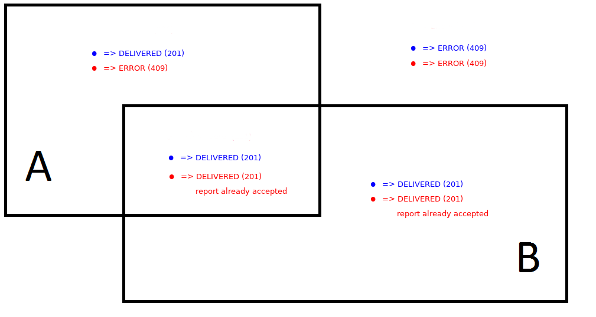

.. _feedbacks:

Observations
============

Une observation est toujours faite en une position géographique donnée. La position géographique est la composante la plus importante, et la seule obligatoire, d'une observation. Les paramètres optionnels étant la description, la catégorie, et éventuellement une ou plusieurs photos.

Tous les utilisateurs peuvent créer des observations.

.. _feedbacks-creation:

Création d'une observation
--------------------------

.. code-block:: bash

    POST /feedbacks/issues

Exemple du minimum requis pour effectuer une observation, une observation est créée sans catégorie et sans description. L'utilisateur émettant cette observation est détecté automatiquement grâce à l'authentification.

.. code-block:: json

    {
        "businessActivity": "4bff7cb9-0fd2-4b44-9b0e-f6d17bb4ef36",
        "geo": {
            "elevation": 1,
            "point": {
                "latitude": 44.851343361295214,
                "longitude": -0.5763262510299683
            }
        }
    }

Exemple plus complet, une catégorie et une description sont précisées :

.. code-block:: json

    {
        "businessActivity": "4bff7cb9-0fd2-4b44-9b0e-f6d17bb4ef36",
        "category": "b0d007d5-e6ad-4113-b2b5-d8a1858a2fb1",
        "description": "Mon feedback 5",
        "geo": {
            "elevation":1,
            "point": {
                "latitude":44.851343361295214,
                "longitude":-0.5763262510299683
            }
        },
        "visibility": "VISIBILITY_PUBLIC"
    }

L'utilisateur peut ensuite ajouter une ou plusieurs images à son observation :

.. code-block:: bash

    POST /feedbacks/{feedback}/images

Exemple :

.. code-block:: json

    {
        "image":"data:image/png;base64,iVBORw0KGgoAAAANSUhEUgAAAAUAAAAFCAIAAAACDbGyAAAACXBIWXMAAAsTAAALEwEAmpwYAAAAB3RJTUUH4QIVDRUfvq7u+AAAABl0RVh0Q29tbWVudABDcmVhdGVkIHdpdGggR0lNUFeBDhcAAAAUSURBVAjXY3wrIcGABJgYUAGpfABZiwEnbOeFrwAAAABJRU5ErkJggg=="
    }

Pour plus d'informations sur l'envoi d'images, voir :ref:`technical-files`.

Rattachement d'une observation à une organisation
-------------------------------------------------

Le service Keyclic ne se contente pas de recueillir des observations : elle les fait ensuite remonter, sous la forme de :ref:`reports`, aux organisations concernées, qui en assureront le traitement. Toute observation doit donc être, dans la mesure du possible, remontée à une organisation sous la forme d'un rapport. Pour cela, quatre cas de figure peuvent se présenter :

- Si la position géographique de l'observation ne correspond à aucune zone de responsabilité, alors l'API retournera une erreur 409 et aucune organisation ne recevra de rapport sur cette observation.

- Si la position géographique de l'observation se trouve dans une zone de responsabilité définie par une organisation, alors le rapport de l'observation est automatiquement remonté à l'organisation en question.

- Si la position géographique de l'observation se trouve sur deux (ou plus) zones de responsabilité appartenant à deux (ou plus) organisations différentes, mais que l'utilisateur n'a pas précisé de catégorie, alors plusieurs rapports sont générés et remontés à toutes les organisations concernées. La première organisation qui acceptera le rapport pourra en effectuer le traitement.

.. _feedbacks-lifecyle:

Modération et cycle de vie d'une observation
--------------------------------------------

Après qu'un utilisateur a créé une nouvelle observation, celle-ci possède le statut PENDING_REVIEW : en attente de modération. Elle devra être validée par un *administrateur d'application* (sauf cas particulier d'une :ref:`feedbacks-organization-member`).

Voir : :ref:`technical-states`

Un *administrateur d'application* valide une observation avec le endpoint :

.. code-block:: bash

    POST /feedbacks/{feedback}/state

Exemple :

.. code-block:: json

    [
        {
            "op":"replace",
            "path":"transition",
            "value":"accept"
        }
    ]

L'observation prend alors le statut DELIVERED et un rapport est créé sur cette observation.

Voir : :ref:`reports`

Pour refuser une observation :

.. code-block:: bash

    [
        {
            "op":"replace",
            "path":"transition",
            "value":"refuse"
        }
    ]

L'observation prend alors le statut REFUSED.

.. _feedbacks-organization-member:

Observation postée par un membre d'organisation
-----------------------------------------------

Les membres (:ref:`members`) peuvent poster des observations de la même façon que tous les utilisateurs. Cependant, si un membre d'organisation fournit, dans sa requête, l'identifiant de son organisation, il entre dans le mode de fonctionnement que nous avons appelé le "mode pro", et son observation pourra être traitée différemment :

- Si son observation est positionnée dans une zone de responsabilité régie par son organisation, alors cette observation est automatiquement validée (sans passer par l'étape de modération) et le rapport créé qui en découle est automatiquement accepté.

- Si son observation n'est pas positionnée dans une zone de responsabilité régie par son organisation, alors son observation est refusée et une erreur 409 est retournée.

.. _feedbacks-normal-mode-vs-pro-mode:

Mode normal vs "Mode pro"
-------------------------

Sur la figure ci-dessous, le rectangle A représente une zone de responsabilité appartenant à une organisation A, et le rectangle B représente une zone de responsabilité appartenant à une organisation B.

Chaque point représente une observation effectuée **par un utilisateur membre de l'organisation B**.

En bleu : observations effectuées en passant l'identifiant de son organisation (correspond au "mode pro").
En rouge : observations effectuées sans passer l'identifiant de son organisation. Ces observations sont donc identiques à celle d'un utilisateur lambda.

.. _feedbacks-lifecyle-overview:

Résumé du cycle de vie d'une observation
----------------------------------------

.. image:: images/feedback_workflow.png

.. _feedbacks-retrieving:

Récupération des observations
-----------------------------

Pour récupérer les observations :

.. code-block:: bash

    GET /feedbacks

Cette requête retourne uniquement les observations dont le statut est DELIVERED.

Plusieurs critères permettent de filtrer les observations.

**Par statut : paramètre state**

Par exemple, pour filtrer les observations en attente de validation, un administrateur d'application effectuera la requête :

.. code-block:: bash

    GET /feedbacks?state=PENDING_REVIEW

**Autour d'un point : paramètre geo_near**

Exemple :

.. code-block:: bash

    GET /feedbacks?geo_near[radius]=1000&geo_near[geo_coordinates]=+44.8-0.5

retournera les observations situées dans un rayon de 1000 mètres autour du point de latitude +44.8 et de longitude 0.5.

**Dans un GeoHash : paramètre geo_hash**

GeoHash est un système de géocodage [...] basé sur une fonction de hachage qui subdivise la surface terrestre selon une grille hiérarchique. (Source : `Wikipedia <https://fr.wikipedia.org/wiki/Geohash>`_)

Pour plus d'informations sur GeoHash, voir :

- `Site officiel de GeoHash <http://geohash.org/>`_
- `GeoHash explorer <http://geohash.gofreerange.com/>`_

Les observations peuvent être filtrées par GeoHash de la façon suivante :

.. code-block:: bash

    GET /feedbacks?geo_hash[]=ezzx&geo_hash[]=ezzz

retournera les observations comprises dans les geo hash ezzx et ezzz.

**Sur une période donnée : paramètres before et after**

Exemple :

.. code-block:: bash

    GET /feedbacks?after=2017-01-10T00:00:00+05:00&before=2017-02-22T23:59:59+05:00

retournera les observations effectuées entre le 10/01/2017 et le 22/02/2017.

Les dates sont écrites au format  : `ISO 8601 <https://www.iso.org/iso-8601-date-and-time-format.html>`_.

**Par organisation**

.. code-block:: bash

    GET /feedbacks?organization={organization}

.. _feedbacks-comments:

Commentaires
------------

Les utilisateurs de la communauté peuvent commenter une observation :

.. code-block:: bash

    POST /feedbacks/{feedback}/comments

Exemple :

.. code-block:: json

    {
        "text":"Mon commentaire"
    }

Pour récupérer les commentaires d'une observation :

.. code-block:: bash

    GET /feedbacks/{feedback}/comments

.. _feedbacks-contributions:

Soutiens
--------

Un utilisateur peut soutenir une contribution en effectuant la requête suivante, sans paramètres :

.. code-block:: bash

    POST /feedbacks/{feedback}/contributions

Pour récupérer tous les soutiens effectués sur une observation :

.. code-block:: bash

    GET /feedbacks/{feedback}/contributions
