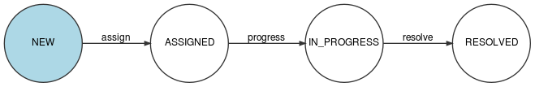

.. _reports:

Rapports
========

Chaque fois qu'une observation est acceptée, après validation par un administrateur de l'application sauf dans certains cas où la modération est automatique (voir : :ref:`feedbacks-lifecyle`), un rapport est créé.

Un administrateur d'organisation récupère les rapports concernant son organisation avec :

.. code-block:: bash

    GET /organizations/{organization}/reports

Et un rapport donné est récupéré avec :

.. code-block:: bash

    GET /reports/{report}

.. _reports-lifecycle:

Cycle de vie d'un rapport
-------------------------

Quand un nouveau rapport est généré à partir d'une observation, il possède le statut NEW.

Le schéma ci-dessous montre l'évolution du statut d'un rapport en fonction des actions qui sont effectuées sur ce rapport.

.. image:: images/report_workflow.png

Un endpoint unique permet de changer le statut du rapport :

.. code-block:: bash

    PATCH /reports/{report}/state

Par exemple, pour passer du statut NEW au statut ACCEPTED, l'administrateur de l'organisation effectuera un "accept" en passant dans le corps de la requête :

.. code-block:: json

    [
      {
        "op":"replace",
        "path":"/transition",
        "value":"accept"
      }
    ]

Un rapport ne peut être clôturé (statut CLOSED) que si :

- Toutes les interventions associées à ce rapport ont été clôturées ou refusées (voir ci-dessous le paragraphe :ref:`reports-interventions`).
- Tous les rapports délégués à d'autres organisations à partir de ce rapport ont été clôturés (voir ci-dessous le paragraphe :ref:`reports-delegation`).

.. _reports-interventions:

Interventions
----------

Une intervention est une action à réaliser associée à un rapport et assignée à un membre de l'organisation.

Pour récupérer l'ensemble des interventions associées à un rapport :

.. code-block:: bash

    GET /reports/{report}/operations

**Création et modification d'une intervention**

Un administrateur d'organisation crée une intervention sur un rapport en effectuant la requête :

.. code-block:: bash

    POST /operations

Exemple :

.. code-block:: json

    {
        "description":"Description de l'intervention",
        "name":"Nom de l'intervention",
        "report":"cb7118b5-a821-4cf2-9475-0c0d0efdb8d0"
    }

Une intervention nouvellement créée possède le statut NEW.

Une ou plusieurs images peuvent être ajoutées à l'intervention :

.. code-block:: bash

    POST /operations/{operation}/images

Exemple :

.. code-block:: json

    {
        "image":"data:image/png;base64,iVBORw0KGgoAAAANSUhEUgAAAAUAAAAFCAIAAAACDbGyAAAACXBIWXMAAAsTAAALEwEAmpwYAAAAB3RJTUUH4QIVDRUfvq7u+AAAABl0RVh0Q29tbWVudABDcmVhdGVkIHdpdGggR0lNUFeBDhcAAAAUSURBVAjXY3wrIcGABJgYUAGpfABZiwEnbOeFrwAAAABJRU5ErkJggg=="
    }

La description d'une intervention peut être modifiée avec la requête :

.. code-block:: bash

    PATCH /operations/{operation}

dont le body est :

.. code-block:: json

    [
      {
        "op":"replace",
        "path":"/description",
        "value":"Nouvelle description"
      }
    ]

**Assignation**

Pour assigner une intervention à un membre de l'organisation, l'administrateur de l'organisation effectue la requête :

.. code-block:: bash

    POST /operations/{operation}/assign

dont le body est :

.. code-block:: bash

    {
      "member":"{member}",
    }

où {member} est l'identifiant du membre à qui est assignée l'intervention.

**Acceptation ou refus**

Une fois assignée, l'intervention peut être acceptée ou refusée, soit par la personne à qui l'intervention a été assignée, soit par un administrateur de l'organisation. Pour accepter l'intervention :

.. code-block:: bash

    PATCH /operations/{operation}/state

dont le body est :

.. code-block:: json

    [
      {
        "op":"replace",
        "path":"/transition",
        "value":"accept"
      }
    ]

**Intervention en cours et clôture**

Une fois acceptée, l'intervention peut-être passée "en cours" puis "clôturée", soit par la personne à qui l'intervention a été assignée, soit par un administrateur de l'organisation.

**Résumé du cycle de vie d'une intervention**

**Commentaires**

Il est possible de commenter une intervention :

.. code-block:: bash

    POST /operations/{operation}/comments

dont le body est :

.. code-block:: json

    {
        "text":"Mon commentaire"
    }

Pour récupérer tous les commentaires d'une intervention :

.. code-block:: bash

    GET /operations/{operation}/comments

**Logs d'une intervention**

Un administrateur d'organisation peut consulter l'historique d'une intervention avec :

.. code-block:: bash

    GET /operations/{operation}/logs

.. _reports-delegation:

Délégation de rapports
----------------------

Un administrateur d'une organisation peut déléguer un rapport à l'une des organisations partenaires.

Voir : :ref:`organizations-relationships`

Pour déléguer un rapport, un administrateur de l'organisation effectue la requête :

.. code-block:: bash

    POST /organizations/{organization}/delegates

où {organization} est l'identifiant de l'organisation **courante** (dont le membre est administrateur).

Exemple :

.. code-block:: json

    {
      "report":"cb7118b5-a821-4cf2-9475-0c0d0efdb8d0",
      "organization":"a31d9ab7-9476-45f2-8cc7-033bf40bbcfa"
    }

où a31d9ab7-9476-45f2-8cc7-033bf40bbcfa est l'identifiant de l'organisation à laquelle le rapport est délégué.

Déléguer un rapport ne signifie pas que ce rapport est simplement transmis. En effet, le rapport initial n'est pas modifié ni transféré, mais un nouveau rapport "enfant" est créé et attribué à l'organisation partenaire. Ce rapport enfant sera traité par l'organisation partenaire de la même façon que le rapport initial : changements de statuts, interventions, assignations des interventions, etc, jusqu'à sa clôture.

L'organisation partenaire peut elle-même déléguer le rapport à l'une de ses partenaires et ainsi de suite. Pour qu'un rapport puisse être clôturé, il est obligatoire que le rapport enfant, s'il existe, ait été préalablement clôturé par l'organisation partenaire.

.. _reports-export:

Export des rapports
-------------------

Un administrateur d'organisation peut exporter tous les rapports de son organisation au format Excel :

.. code-block:: bash

    POST /organizations/{organization}/reports/exports

Une archive contenant le fichier Excel listant tous les rapports et les images associées à ces rapports est alors envoyé par email à l'administrateur authentifié.
